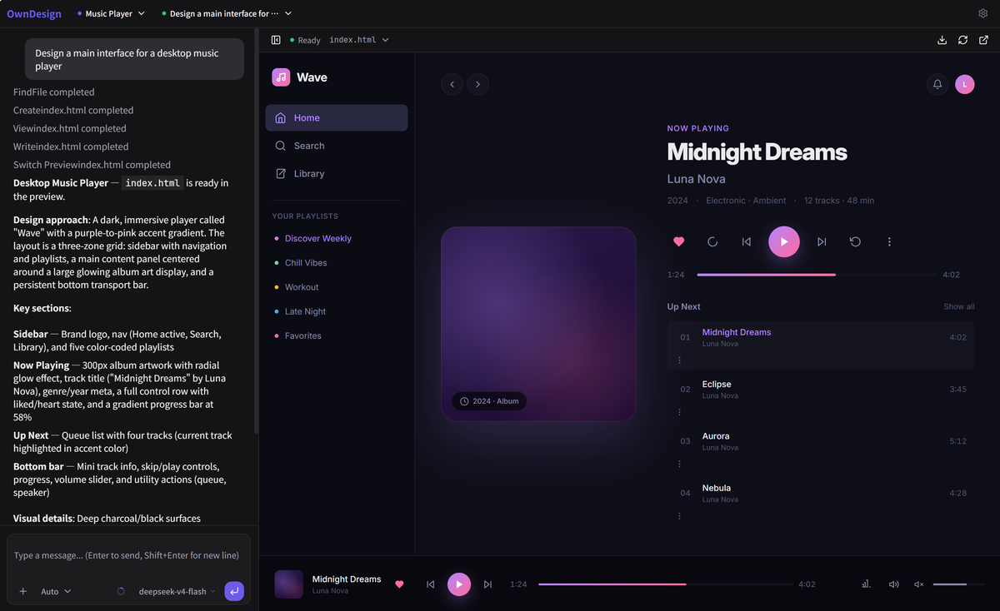

# OwnDesign

[中文](README.md) | [English](README.en.md)

OwnDesign is an AI Agent tool focused on interface design, mainly built for individual developers: describe the page you want, and it quickly generates it with a live preview. It is not tied to any model service, so you can connect the model you prefer.



## Quick Start

Make sure Node.js `>= 22` is installed.

Use it directly:

```bash
npx owndesign
```

Or install it globally first:

```bash
npm i -g owndesign
owndesign
```

After startup, open the local address shown in the terminal, then configure your model provider, API key, and model name in Settings.

## What Is This Tool?

OwnDesign puts "AI chat" and "live web preview" in one workspace. You can describe the page you want as if you were talking to a designer, including page type, layout, copy, colors, style, and interaction details. The Agent generates the corresponding HTML page and shows it in the preview area.

It is not an online platform bound to a fixed service. It is a personal tool you can start locally. You can connect DeepSeek, OpenAI-compatible APIs, Anthropic, or other models based on your own preference.

## Core Capabilities

- **Focused on interface design**: Built for web pages, landing pages, campaign pages, product prototypes, and similar UI generation scenarios.
- **Natural language generation**: Describe what you need, and the Agent creates the page.
- **Conversational editing**: Continue describing changes, and the Agent updates the existing page.
- **Live preview**: See the result immediately after generation or edits.
- **No service lock-in**: OwnDesign itself is not tied to a fixed model service.
- **Bring your own model**: Connect the model you personally prefer.
- **No design skills required**: Made for individual developers who want to create visual pages quickly.

## Run From Source

If you are running the project from source:

```bash
pnpm install
pnpm dev
```

The default local development entry is:

```text
http://127.0.0.1:3710
```
