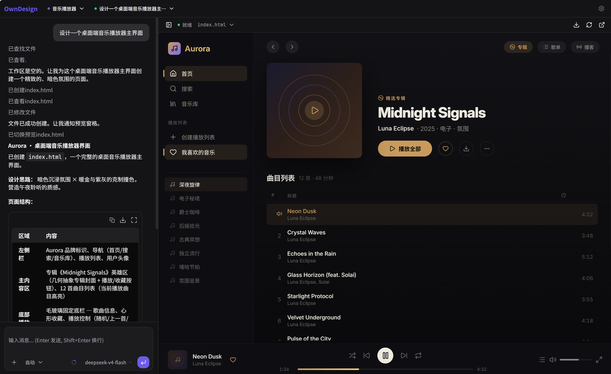

# OwnDesign

[中文](README.md) | [English](README.en.md)

OwnDesign 是一个专注于界面设计的 AI Agent 工具，主要面向个人开发者：描述你想要的页面，它会快速生成并实时预览，不绑定任何模型服务，你可以接入自己喜欢的模型。



## 快速启动

确保本机已安装 Node.js `>= 22`。

直接使用：

```bash
npx owndesign
```

也可以全局安装后启动：

```bash
npm i -g owndesign
owndesign
```

启动后按终端提示打开本地地址，在设置中配置你的模型提供商、API Key 和模型名称。

## 这是什么工具？

OwnDesign 把「AI 对话」和「网页实时预览」放在同一个工作区里。你可以像和设计师沟通一样描述页面需求，例如页面类型、布局、文案、配色、风格和交互细节，Agent 会生成对应的 HTML 页面，并在预览区域展示结果。

它不是绑定某个固定服务的在线平台，而是一个可以本地启动的个人工具。你可以根据自己的偏好接入 DeepSeek、OpenAI 兼容接口或 Anthropic 等模型。

## 核心能力

- **专注界面设计**：围绕网页、落地页、活动页、产品原型等界面生成场景设计。
- **自然语言生成**：用文字描述需求，Agent 自动生成页面。
- **对话式修改**：继续说明修改点，Agent 会调整已有页面。
- **实时预览**：生成和修改后立即查看效果。
- **无服务绑定**：工具本身不绑定固定模型服务。
- **自带模型选择权**：个人可以接入自己喜欢的模型。
- **不需要懂设计**：适合想快速做出可视化页面的个人开发者。

## 源码运行

如果你是从源码运行项目：

```bash
pnpm install
pnpm dev
```

本地开发入口默认是：

```text
http://127.0.0.1:3710
```
